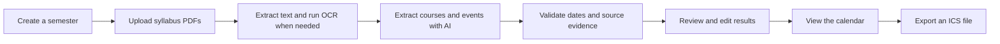

# Syllabus Calendar

Syllabus Calendar turns course PDFs into a semester calendar that students can verify before anything is published.

Upload one or more syllabi, follow each file through extraction, review uncertain dates beside the source PDF, and export the confirmed schedule as an ICS file.

## Product flow



## What works today

- Google sign in through Supabase Auth and a credential-free local demo mode
- Multiple saved semesters with permanent semester deletion
- Up to 10 PDF uploads at a time with a 20 MB limit per file
- Processing limits of 200 pages, 50 OCR pages, and 500,000 extracted characters per PDF
- Independent processing state for every PDF
- Text extraction with PyMuPDF and OCR fallback with Tesseract
- Structured syllabus extraction with OpenAI
- Deterministic checks for missing dates, source evidence, semester bounds, and date conflicts
- Human review beside the original PDF
- Inline event editing with Confirm, Keep pending, Remove, Undo, and Restore actions
- Recurring assignment series with series-level review and individual occurrence editing
- Timeline, Month, and List calendar views with course filters
- Deep links from calendar items to the exact Review event
- Filtered ICS export for Google Calendar, Apple Calendar, and Outlook
- Responsive desktop and mobile layouts
- Light, dark, and system themes

## AI extraction

New documents use `gpt-5.6-luna` as the primary extraction model. Every result is checked by backend rules before it reaches Review.

The backend makes at most one `gpt-5.6-terra` fallback call for a document when it encounters any of these conditions

- `LOW_CONFIDENCE`
- `SOURCE_MISMATCH`
- `SOURCE_PAGE_MISSING`
- `DATE_CONFLICT`
- Invalid structured output from the primary model

When only part of a Luna response needs repair, Terra receives the flagged items and leaves validated items unchanged. A failed repair keeps valid Luna data and marks the unresolved items for Review. If neither model can produce a valid structure, the file is marked as failed and can be retried.

The AI identifies recurring rules and their source evidence. Python expands supported weekly and lecture-relative rules into concrete dates, applies exceptions, keeps dates inside the semester, removes duplicates, and limits each series to 200 occurrences.

AI output never goes directly onto the published calendar. Only confirmed dated events appear in the Calendar API and ICS export.

## Technology

| Area | Technology |
| --- | --- |
| Frontend | React 19, TypeScript, Vite, React Router, TanStack Query |
| Forms and UI | React Hook Form, Zod, Tailwind CSS, Lucide |
| Calendar | FullCalendar plus custom Timeline and List views |
| Authentication | Supabase Auth with Google OAuth |
| API | FastAPI, Pydantic 2, Uvicorn |
| Database | PostgreSQL with SQLAlchemy 2 and Alembic |
| Background work | Celery and Redis |
| PDF processing | PyMuPDF, pdf2image, Tesseract OCR |
| AI | OpenAI Structured Outputs with Luna and Terra routing |
| Export | icalendar |
| Testing | Pytest, Vitest, Testing Library, Playwright |
| Deployment | Vercel, Railway, Supabase |

## Repository layout

```text
.
|-- frontend/
|   |-- src/components/       Shared UI and review components
|   |-- src/pages/            Product screens
|   |-- src/lib/              API, auth, semester, and shared types
|   |-- src/theme/            Light, dark, and system theme logic
|   `-- e2e/                  Isolated Playwright flow
|-- backend/
|   |-- app/api.py            FastAPI routes
|   |-- app/processing.py     PDF, OCR, AI routing, validation, recurrence
|   |-- app/models.py         SQLAlchemy models
|   |-- app/storage.py        Local and Supabase Storage adapters
|   |-- app/worker.py         Celery worker
|   |-- alembic/              Database migrations
|   `-- tests/                Backend test suite
`-- docs/                     Design and implementation notes
```

## Local development

### Requirements

- Python 3.12
- [uv](https://docs.astral.sh/uv/)
- Node.js 20.19 or newer
- npm
- Tesseract and Poppler only when testing scanned PDFs

### Fast local demo

The demo profile uses a local account, SQLite, local file storage, eager processing, and the deterministic local extractor. It does not need Supabase, Redis, or an OpenAI key.

Create `backend/.env` with the following values

```dotenv
APP_ENV=development
DATABASE_URL=sqlite:///./syllabus_calendar.db
AUTH_MODE=dev
PROCESSING_MODE=eager
EXTRACTION_MODE=local
CORS_ORIGINS=http://localhost:5175,http://127.0.0.1:5175
STORAGE_MODE=local
LOCAL_STORAGE_PATH=.data/uploads
CELERY_TASK_ALWAYS_EAGER=true
```

Create `frontend/.env` with the following values

```dotenv
VITE_API_URL=http://localhost:8000/api
VITE_AUTH_MODE=demo
```

Start the API

```powershell
cd backend
uv sync --python 3.12
uv run uvicorn app.main:app --host 127.0.0.1 --port 8000
```

Start the web app in a second terminal

```powershell
cd frontend
npm install
npm run dev -- --host 127.0.0.1 --port 5175 --strictPort
```

Open [http://127.0.0.1:5175](http://127.0.0.1:5175) and choose `Try the local demo`.

FastAPI documentation is available at [http://127.0.0.1:8000/api/docs](http://127.0.0.1:8000/api/docs).

### Run the real OpenAI extractor locally

Keep the local demo configuration and change these backend values

```dotenv
EXTRACTION_MODE=openai
OPENAI_API_KEY=your-key
OPENAI_MODEL=gpt-5.6-luna
OPENAI_FALLBACK_MODEL=gpt-5.6-terra
MAX_PDF_PAGES=200
MAX_OCR_PAGES=50
MAX_EXTRACTED_TEXT_CHARACTERS=500000
```

Restart the API after changing the environment. Never commit an API key or place it in a frontend `VITE_` variable.

## Processing states

Every uploaded document moves independently through these states

```text
queued
extracting_text
running_ocr
extracting_events
validating
needs_review
completed
failed
```

One failed PDF does not block the other files in the semester. Failed jobs can be retried. Completed or review-ready jobs can be manually reprocessed while preserving the old result until the replacement succeeds.

## Core API

| Method | Path | Purpose |
| --- | --- | --- |
| `GET` | `/api/health` | Service health |
| `POST` | `/api/semesters` | Create a semester |
| `GET` | `/api/semesters` | List saved semesters and counts |
| `DELETE` | `/api/semesters/{semester_id}` | Permanently delete a semester and its files |
| `POST` | `/api/semesters/{semester_id}/syllabi` | Upload syllabus PDFs |
| `GET` | `/api/semesters/{semester_id}/jobs` | Read per-file processing state |
| `POST` | `/api/jobs/{job_id}/retry` | Retry a failed job |
| `POST` | `/api/jobs/{job_id}/reprocess` | Reprocess a completed or review-ready job |
| `GET` | `/api/semesters/{semester_id}/review` | Load courses, documents, events, and recurring series |
| `PATCH` | `/api/extracted-events/{event_id}` | Edit or update one event |
| `PATCH` | `/api/recurring-series/{series_id}` | Update a recurring series |
| `POST` | `/api/semesters/{semester_id}/review/complete` | Complete review when no blocking items remain |
| `GET` | `/api/semesters/{semester_id}/events` | Load confirmed calendar events |
| `GET` | `/api/semesters/{semester_id}/calendar.ics` | Export confirmed events |

All business routes verify ownership in FastAPI. PostgreSQL deployments also use row level security. The Supabase service role key stays on the backend.

## Database

The current schema contains seven business tables

- `profiles`
- `semesters`
- `courses`
- `syllabus_documents`
- `processing_jobs`
- `recurring_event_series`
- `extracted_events`

Run migrations for PostgreSQL and production environments

```powershell
cd backend
uv run alembic upgrade head
```

SQLite development creates its tables automatically when the API starts.

## Verification

Run the backend suite

```powershell
cd backend
uv run pytest
uv run ruff check --no-cache app tests alembic
```

Run the frontend checks

```powershell
cd frontend
npm run typecheck
npm test
npm run build
npm run test:e2e
```

The Playwright runner starts an isolated backend on port `8010` and an isolated frontend on port `5180`. It uses a temporary SQLite database and upload directory so tests cannot write into development data.

## Production deployment

### Supabase

Create a Supabase project, enable the Google provider, and add the local and Vercel callback URLs to the authentication redirect allow list.

Set these frontend variables in Vercel

```dotenv
VITE_API_URL=https://your-api.railway.app/api
VITE_AUTH_MODE=supabase
VITE_SUPABASE_URL=https://your-project.supabase.co
VITE_SUPABASE_PUBLIC_KEY=your-publishable-key
```

Set these backend variables in Railway

```dotenv
APP_ENV=production
DATABASE_URL=postgresql+psycopg://...
AUTH_MODE=supabase
PROCESSING_MODE=celery
EXTRACTION_MODE=openai
CORS_ORIGINS=https://your-app.vercel.app
SUPABASE_URL=https://your-project.supabase.co
SUPABASE_SERVICE_ROLE_KEY=backend-only-service-role-key
SUPABASE_STORAGE_BUCKET=syllabi
STORAGE_MODE=supabase
REDIS_URL=redis://...
CELERY_TASK_ALWAYS_EAGER=false
OPENAI_API_KEY=...
OPENAI_MODEL=gpt-5.6-luna
OPENAI_FALLBACK_MODEL=gpt-5.6-terra
```

Run `uv run alembic upgrade head` against the Supabase PostgreSQL database before serving traffic.

### Railway

Create one API service and one Celery worker from `backend/Dockerfile`, then attach one Redis service. Both application services use the same backend environment. The image already includes Tesseract and Poppler.

The API uses the included `railway.json`. The worker command is

```text
celery -A app.worker.celery_app worker --loglevel=INFO
```

### Vercel

Use `frontend` as the Vercel project root. The included `vercel.json` rewrites client-side routes to `index.html`.

## MVP scope

This version focuses on the syllabus-to-calendar workflow. It does not include quiz generation, flashcards, document chat, direct Google Calendar sync, social features, leaderboards, collaboration, or an admin dashboard.

## License

No license file is included yet. Until one is added, the repository should be treated as all rights reserved.
